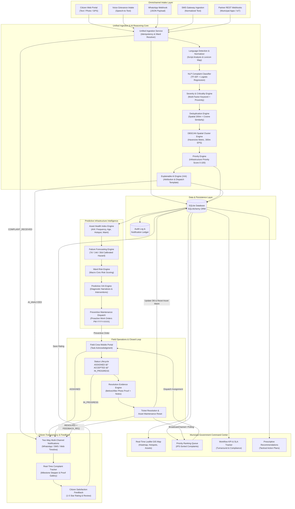
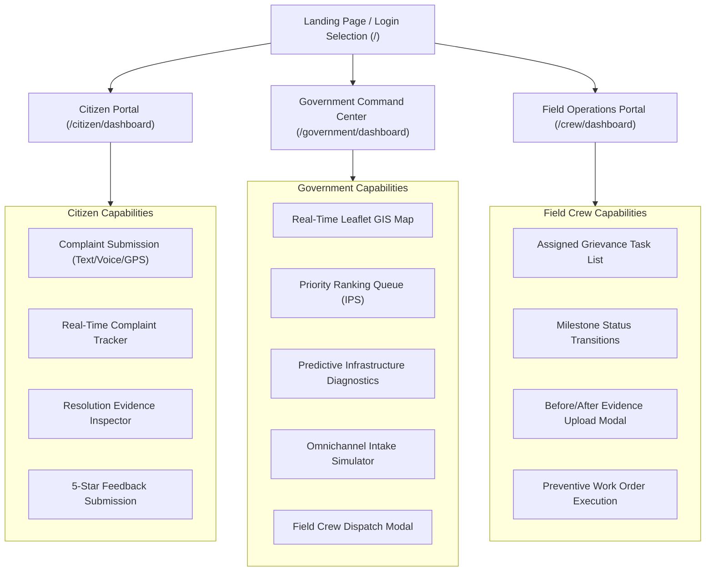
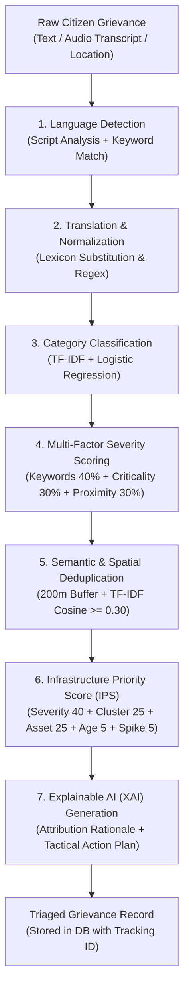
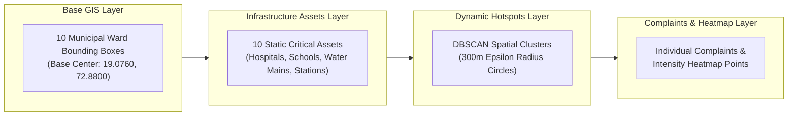
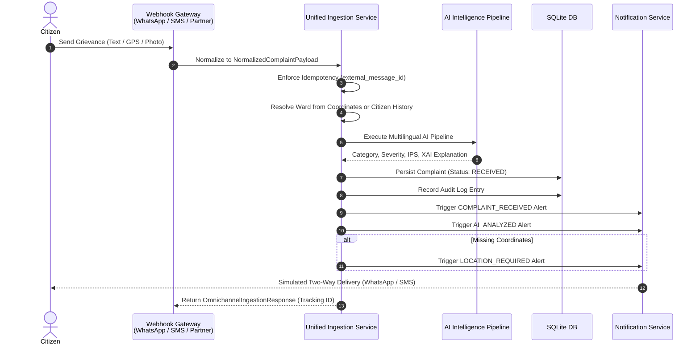
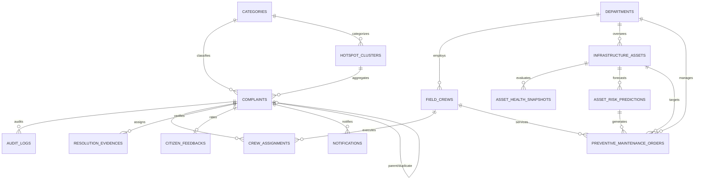

# CivicPulse AI — Technical Design Document

**Platform Title:** CivicPulse AI
**Subtitle:** AI-Powered Omnichannel Civic Grievance Intake, Predictive Municipal Infrastructure Intelligence & Automated Field Operations Platform
**Target Submission:** MY Bharat Hack for Social Cause 2026
**Repository Version:** 1.3.0
**License:** MIT License
**Document Classification:** Engineering Architecture & Technical Design Specification

---

## 1. Project Overview

### 1.1 Purpose
CivicPulse AI is an enterprise-grade civic governance platform designed to transition municipal administration from a traditional, passive grievance-ticketing system into a proactive, predictive, and closed-loop field operations ecosystem. By unifying omnichannel grievance ingestion, natural language processing, automated spatial clustering, predictive infrastructure degradation modeling, and closed-loop dispatch with verifiable photographic proof, the platform ensures rapid grievance resolution and prevents catastrophic public infrastructure failures before they occur.

### 1.2 Problem Being Addressed
Urban local bodies (ULBs) and municipal corporations face structural operational hurdles:
1. **Fragmented & Inaccessible Ingestion:** Citizens communicate grievances across disjointed channels (web portals, social messaging, voice calls, SMS). Non-English complaints in regional vernaculars or colloquial dialects (e.g., Devanagari Hindi, Marathi, Hinglish) frequently suffer misclassification or delayed manual triaging.
2. **Subjective Prioritization & Blind Spots:** Complaints are typically processed First-In, First-Out (FIFO) without automated severity assessment. Critical hazards (e.g., live sparking wires near schools, ruptured water distribution trunks) remain queued behind low-severity issues.
3. **Purely Reactive Operations:** Municipalities typically repair infrastructure only after catastrophic structural failure has occurred and citizen outrage has accumulated. Historical failure velocity, asset age, and localized spatial complaint densities are rarely correlated to forecast imminent breakdowns.
4. **Broken Operational Accountability & Feedback Void:** Field repair dispatch lacks transparent verification. Work orders are frequently marked "completed" without objective photographic evidence or geo-temporal validation, leaving citizens alienated and mistrustful of public services.

### 1.3 Target Users
| User Persona | Role & Primary Objectives | Operational Interface |
| :--- | :--- | :--- |
| **Citizens** | Submit multilingual grievances (text/voice/GPS), track status in real-time, inspect before/after repair proof, and provide 1–5 star satisfaction ratings. | Citizen Portal (`/citizen/dashboard`) |
| **Municipal Officers & Dispatchers** | Monitor citywide real-time GIS map, review AI-ranked grievance queues (IPS), evaluate ward risk, inspect predictive failure forecasts, and dispatch field crews. | Government Command Center (`/government/dashboard`) |
| **Field Crew Leaders & Technicians** | Receive work assignments, transition ticket milestones (`ASSIGNED` → `ACCEPTED` → `IN_PROGRESS`), capture and upload resolution evidence, and execute preventive maintenance work orders. | Field Crew Operations Portal (`/crew/dashboard`) |
| **Civic System Administrators & Evaluators** | Verify system health, monitor webhook telemetry, and execute deterministic demonstration state resets for auditing and validation. | System API (`/api/v1/system/*`) & Navigation Bar |

### 1.4 Core Objectives
- **Sub-Second Multilingual Intake:** Automated script and language identification across 30+ regional languages and dialects, normalizing citizen inputs to standard English for unified classification.
- **Dynamic Multi-Factor Triage:** Compute an objective Infrastructure Priority Score (IPS from 0 to 100) combining physical hazard keywords, category criticality, and proximity to sensitive infrastructure assets.
- **Geospatial Density & Hotspot Discovery:** Automatically detect localized civic breakdowns using DBSCAN spatial clustering over active complaints within a 300-meter threshold.
- **Predictive Asset Intelligence:** Continuously evaluate an Asset Health Index (AHI 0–100) and project forward failure probabilities across 7-day, 14-day, and 30-day horizons.
- **Closed-Loop Field Verification:** Enforce mandatory photographic before/after evidence upload and technical work descriptions before a grievance ticket can transition to `RESOLVED`.
- **Two-Way Citizen Transparency:** Maintain an immutable notification audit log and dispatch simulated two-way status alerts across the citizen's originating channel at every milestone.

---

## 2. System Architecture

CivicPulse AI operates across three unified operational tracks:
- **Track A (Reactive Grievance Resolution & Closed-Loop Dispatch):** Multilingual NLP ingestion, multi-factor severity scoring, DBSCAN spatial clustering, dynamic IPS priority ranking, SLA tracking, and field crew assignment.
- **Track B (Predictive Infrastructure Maintenance & Failure Forecasting):** Continuous Asset Health Index (AHI) computation, calibrated hazard rate failure forecasting (7/14/30 days), Ward Risk Index (WRI) scoring, and preventive maintenance work order dispatch.
- **Track C (Omnichannel Ingestion & Two-Way Citizen Communication):** Unified ingestion engine accepting Web, WhatsApp, SMS, and partner REST webhooks with idempotency enforcement and simulated multi-stage notification dispatch.



---

## 3. Technology Stack

Every component listed below is verified and active in the repository codebase:

| Layer | Technology | Version | Purpose in CivicPulse AI |
| :--- | :--- | :--- | :--- |
| **Frontend Framework** | React | `^18.2.0` | Declarative user interfaces for Citizen, Government, and Field Crew dashboards. |
| **Frontend Tooling** | Vite | `^5.1.6` | High-speed ESM development server and production client asset bundling. |
| **Styling & Design** | Tailwind CSS | `^3.4.1` | Utility-first responsive CSS framework with customized civic theme tokens. |
| **Client Routing** | React Router DOM | `^6.22.3` | Single-page application client-side route handling with role-based protected routes. |
| **HTTP Client** | Axios | `^1.6.8` | Promise-based asynchronous HTTP client communicating with FastAPI endpoints. |
| **Iconography** | Lucide React | `^0.359.0` | Comprehensive civic and technical icon system across all UI dashboards. |
| **Data Visualization** | Recharts | `^2.12.3` | Responsive SVG charts rendering SLA trends, category velocities, and failure risks. |
| **Geospatial Mapping** | Leaflet / React-Leaflet | `^1.9.4` / `^4.2.1` | Interactive mapping canvas supporting heatmaps, cluster overlays, and asset markers. |
| **Cross-Tab Sync** | HTML5 BroadcastChannel | Native API | Zero-latency browser tab synchronization between Field Crew and Government dashboards. |
| **Backend Framework** | FastAPI | `>=0.110.0` | High-performance asynchronous Python REST framework with automatic OpenAPI documentation. |
| **ASGI Server** | Uvicorn (standard) | `>=0.28.0` | Asynchronous server gateway interface runtime handling production HTTP traffic. |
| **Data Validation** | Pydantic / Pydantic-Settings | `>=2.6.0` / `>=2.2.0` | Strict schema validation, request/response serialization, and environment configuration. |
| **ORM & Database** | SQLAlchemy | `>=2.0.28` | Object-relational mapping interfacing SQLite with thread-safe connection pooling. |
| **Embedded Database** | SQLite 3 | Embedded | Local zero-configuration relational storage engine (`./data/civicpulse.db`). |
| **Machine Learning** | Scikit-Learn | `>=1.4.0` | TF-IDF vectorization, Logistic Regression classification, and DBSCAN spatial clustering. |
| **Numerical Computing** | NumPy / Pandas | `>=1.26.0` / `>=2.2.0` | Array manipulation, Haversine geospatial calculations, and trend telemetry aggregation. |
| **Model Serialization** | Joblib | `>=1.3.0` | Binary persistence and loading for trained Scikit-Learn classification pipelines. |
| **Backend Testing** | Pytest / HTTPX | `>=8.0.0` / `>=0.27.0` | Automated unit, API integration, and deterministic flagship demo verification. |
| **Frontend Testing** | Node.js Test Runner | Native (`node:test`) | Native unit test suite validating coordinate normalization and GIS utilities. |
| **Containerization** | Docker & Docker Compose | Multi-Stage | Production deployment bundling FastAPI (Python 3.12-slim) and Frontend (Nginx Alpine). |
| **Cloud Hosting** | Render & Vercel | Cloud PaaS | Decoupled production architecture: Render for FastAPI backend, Vercel for React SPA. |

---

## 4. Frontend Architecture

### 4.1 Application Structure
The frontend application resides in `civicpulse/frontend/src` and is structured into clear modular boundaries:
- **`App.jsx`:** Main routing orchestrator wrapped with `AuthProvider` and `LanguageProvider`.
- **`main.jsx`:** Application bootstrap attaching the React virtual DOM to `index.html`.
- **`index.css`:** Base styles, Tailwind utility imports, and Leaflet CSS overrides.
- **`context/`:** Global state management for authentication sessions and application localization.
- **`pages/`:** High-level screen views aligned with user operational roles.
- **`components/`:** Domain-specific and reusable UI components.
- **`services/`:** Centralized API client modules abstracting REST endpoint communication.
- **`utils/`:** Shared utilities for GIS coordinate validation, constants, and tab synchronization.

### 4.2 Role-Based Portals & Dashboards



#### 1. Citizen Portal (`CitizenDashboard.jsx` & `CitizenPortal.jsx`)
- **Interactive Grievance Submission:** Multi-input form allowing citizens to select grievance categories, enter descriptions in any language, upload reference images, record audio transcripts, and pick GPS coordinates via a dedicated map picker.
- **Tracking & Evidence Verification:** Input field for unique tracking codes (e.g., `CP-2026-XXXX`). Displays milestone stepper (`RECEIVED` → `INVESTIGATING` → `IN_PROGRESS` → `RESOLVED`), assigned crew details, SLA countdown, and verified before/after photographic proof.
- **Citizen Feedback Modal (`FeedbackModal.jsx`):** Enables 1–5 star satisfaction rating and textual review submission once a complaint is in `RESOLVED` status.

#### 2. Government Command Center (`GovernmentDashboard.jsx`)
- **Executive KPI Cards (`OverviewStats.jsx` & `WorkflowKPIs.jsx`):** Displays real-time counts for active complaints, resolved tickets, SLA on-time percentages, average IPS, and active DBSCAN hotspots.
- **Interactive Leaflet Map (`InteractiveMap.jsx`):** Geospatial command canvas rendering heatmap density layers, active DBSCAN hotspot cluster circles, critical infrastructure assets, individual complaint pins, and ward boundaries.
- **Priority Queue (`PriorityTable.jsx`):** Real-time tabular queue sorted by AI-computed Infrastructure Priority Score (IPS). Allows filtering by status, category, ward, and channel, with direct access to XAI diagnostic modals and crew assignment dispatch.
- **Predictive Asset Intelligence (`AssetRiskTable.jsx`, `AssetIntelligenceModal.jsx`, `PredictiveCharts.jsx`):** Displays municipal assets with Asset Health Index scores, 7/14/30-day failure risk forecasting, contributing factor narratives, and one-click preventive work order creation.
- **Omnichannel Intake & Simulator (`OmnichannelIntakeView.jsx`, `OmnichannelSimulatorModal.jsx`):** Visual breakdown of grievances ingested across Web, WhatsApp, SMS, and Partner webhooks, complete with an interactive in-browser simulation modal to test live WhatsApp and SMS payloads.
- **Trend & Spike Analytics (`TrendAnalytics.jsx`):** Visualizes 14-day category complaint velocities and alerts operators to emerging volume surges.
- **Explainable Recommendations (`RecommendationsPanel.jsx`):** Prescriptive action cards detailing root-cause feature attributions and tactical municipal engineering action plans.

#### 3. Field Crew Operations Portal (`FieldCrewDashboard.jsx`)
- **Role-Based Crew Queue:** Shows grievances and preventive maintenance work orders assigned specifically to the logged-in field crew.
- **Milestone Status Transitions:** Enables mobile crew leaders to acknowledge tasks (`ACCEPTED`), commence on-site repair (`IN_PROGRESS`), and finalize resolution.
- **Resolution Proof Modal (`ResolutionUploadModal.jsx`):** Modal requiring field crew to upload or link an "after repair" photograph and input a technical resolution description before ticket closure is permitted.
- **Preventive Order Execution (`PreventiveCompletionModal.jsx`):** Allows crews to record technical completion notes for scheduled asset overhauls (e.g., ultrasonic testing, valve gasket replacement), automatically resetting the asset's degradation cycle.

### 4.3 Routing & Navigation Architecture
Configured in `src/App.jsx` using `react-router-dom` v6:
- `/`: Public landing page with role-selection cards (`LoginSelection.jsx`).
- `/citizen/login`, `/government/login`, `/crew/login`: Role-specific authentication screens with pre-filled demo credential quick-fill buttons.
- `/citizen/dashboard`: Protected citizen portal (`allowedRole="citizen"`).
- `/government/dashboard`: Protected command center (`allowedRole="government"`).
- `/crew/dashboard`: Protected field crew portal (`allowedRole="field_crew"`).
- Aliases: `/portal` → `/citizen/dashboard`, `/dashboard` → `/government/dashboard`, `/crew` & `/operations` → `/crew/dashboard`.
- `*`: Fallback view rendering a styled 404 screen (`NotFound.jsx`).

### 4.4 Voice Input Engine (`VoiceRecorder.jsx`)
Implemented via the browser Web Speech API (`webkitSpeechRecognition` / `SpeechRecognition`) with an automated fallback to pre-recorded municipal voice audio simulations:
1. Citizen clicks microphone button; audio recording initiates with visual pulsation.
2. Speech-to-text captures real-time transcript in native language (e.g., Hindi, Marathi, Spanish, English).
3. Transcript is automatically forwarded to `/api/v1/citizen/voice-transcribe`.
4. Backend executes language detection, normalizes to English, classifies the category, and populates the grievance form with high-confidence predictions.

### 4.5 GIS Architecture & Coordinate Safeguards (`gis.js`)
Geospatial visualization relies on Leaflet 1.9 and React-Leaflet 4.2. To guarantee zero frontend runtime crashes from malformed, missing, or out-of-range GPS coordinates ingested from external channels, the application routes all GIS data through `src/utils/gis.js`:
- `isValidCoordinate(lat, lng)`: Enforces strict numerical bounds (latitude $\in [-90, 90]$, longitude $\in [-180, 180]$), explicitly rejecting `null`, `undefined`, boolean values, `NaN`, and empty strings.
- `ensureValidCenter(center, fallback)`: Guarantees `MapContainer` center coordinates always resolve to valid numbers, falling back to Mumbai Metro Civic Center `[19.0760, 72.8800]`.
- `extractCoordinates(item, fallbackLookup)`: Normalizes disparate coordinate schemas (`{lat, lng}`, `{latitude, longitude}`, `{centroid_lat, centroid_lon}`, `{coordinates: [lat, lng]}`) into a standard array `[lat, lng]`.
- `filterValidGisItems(items)`: Strips invalid records prior to map layer rendering.

### 4.6 Cross-Tab State Synchronization (`syncChannel.js`)
To provide real-time updates when an evaluator or operator runs the Government Command Center and Field Crew Portal in separate browser tabs:
- `broadcastResolution(data)`: Emits a `COMPLAINT_RESOLVED` event over `BroadcastChannel("civicpulse_resolution_sync")`.
- `subscribeToResolutions(callback)`: Government Dashboard subscribes to this channel; upon receiving an event, it triggers immediate cache invalidation and background re-fetching of complaint queues, map layers, and SLA metrics without requiring a full browser page refresh. A 15-second polling interval acts as a resilient fallback.

---

## 5. Backend Architecture

### 5.1 Application Entry Point (`main.py`)
The backend is built with FastAPI and runs on an asynchronous ASGI event loop:
- **Lifespan Context Manager:** Invokes `init_db(force_seed=True)` on startup to guarantee database schema integrity and populate the deterministic baseline state.
- **CORS Configuration:** Reads `BACKEND_CORS_ORIGINS` from Pydantic settings, authorizing cross-origin communication from local development servers (`localhost:5173`, `127.0.0.1:5173`) and production Vercel domains.
- **Dynamic Port Binding:** Binds to `os.getenv("PORT", "8000")` to comply with cloud container runtime requirements (such as Render).
- **Interactive Documentation:** Serves Swagger UI at `/api/v1/docs` and ReDoc at `/api/v1/redoc`.

### 5.2 Service & Module Organization
The backend in `civicpulse/backend/app` adheres to a strict layered service architecture:

```
backend/
├── main.py                     # ASGI application entry point & lifespan
├── requirements.txt            # Python dependencies
├── app/
│   ├── ai/                     # AI Reasoning & ML Core
│   │   ├── clustering/         # Deduplication & DBSCAN spatial clustering
│   │   ├── explainability/     # XAI attribution & dispatch templates
│   │   ├── language/           # Language detection & English translation
│   │   ├── nlp/                # TF-IDF + Logistic Regression classification
│   │   ├── predictive/         # Asset health, failure forecasting & ward risk
│   │   ├── scoring/            # Infrastructure Priority Score (IPS)
│   │   ├── severity/           # Keyword & proximity multi-factor severity
│   │   ├── trends/             # 14-day velocity & surge detection
│   │   └── pipeline.py         # End-to-end composite intelligence pipeline
│   ├── api/v1/                 # REST API routing layer
│   │   ├── api.py              # Aggregated v1 APIRouter
│   │   └── endpoints/          # Route handlers (citizen, gov, analytics, etc.)
│   ├── core/                   # Application settings & database engine
│   │   ├── config.py           # Pydantic BaseSettings (.env loading)
│   │   └── database.py         # SQLAlchemy engine & SessionLocal factory
│   ├── db/                     # Database seeding & lifecycle scripts
│   │   ├── init_db.py          # Table initialization
│   │   ├── reset_demo.py       # Deterministic demo state reset script
│   │   └── seed_data.py        # Baseline municipal entity seed dataset
│   ├── models/                 # SQLAlchemy ORM database models
│   ├── schemas/                # Pydantic request & response models
│   ├── services/               # Business logic services
│   └── utils/                  # Coordinate ward bounding-box resolver
└── tests/                      # Automated test suite (68 tests + demo verify)
```

### 5.3 Database Interaction
- **Engine Configuration (`database.py`):** Configures SQLite via `create_engine(settings.DATABASE_URL, connect_args={"check_same_thread": False})`.
- **Session Management:** Utilizes a standard FastAPI dependency generator `get_db()` yielding a scoped `SessionLocal`, ensuring clean commit/rollback boundaries and deterministic connection teardown via `finally: db.close()`.

### 5.4 Error Handling & HTTP Status Standards
The backend implements consistent error handling via FastAPI's `HTTPException`:
- `400 Bad Request`: Triggered by invalid status transitions (e.g., accepting an assignment not in `ASSIGNED` status), missing resolution evidence, or empty grievance text.
- `403 Forbidden`: Returned when `/system/demo-reset` is called in production without the `ALLOW_PROD_RESET` bypass flag.
- `404 Not Found`: Returned when looking up nonexistent complaints, assets, crews, or assignments.
- `409 Conflict`: Returned on duplicate external message IDs (`external_message_id`) to enforce webhook idempotency, or when duplicate citizen feedback is submitted for a single ticket.
- `500 Internal Server Error`: Safe catch-all returning structured error details during unexpected runtime failures.

### 5.5 Health & System Telemetry Endpoints
- **`GET /api/v1/health`:** Evaluates API operational status, service identifier, runtime version, environment, and UTC timestamp.
- **`GET /api/v1/system/info`:** Exposes active operational tracks (Track A, Track B, Track C) and active sub-components.
- **`POST /api/v1/system/demo-reset`:** Drops and recreates all database tables, restoring the exact demonstration baseline.

---

## 6. AI Reasoning Pipeline

The AI reasoning engine (`civicpulse/backend/app/ai/pipeline.py`) coordinates multi-stage inference from raw citizen text to an actionable municipal dispatch decision:



### 6.1 Language Detection (`detector.py`)
- Analyzes character Unicode codepoints across 7 major Indic script ranges: Devanagari (`0x0900–0x097F`), Bengali (`0x0980–0x09FF`), Tamil (`0x0B80–0x0BFF`), Telugu (`0x0C00–0x0C7F`), Kannada (`0x0C80–0x0CFF`), Gujarati (`0x0A80–0x0AFF`), and Gurmukhi/Punjabi (`0x0A00–0x0A7F`).
- If Devanagari script is detected, it disambiguates Marathi from Hindi using distinct Marathi stem keywords (`आहे`, `नाही`, `रस्ता`, `खड्डा`, `पाणी`, `फुटला`, `कचरा`, etc.).
- For Latin-script text, it performs token intersection against specialized Hinglish (`paani`, `gaddha`, `sadak`, `kachra`, `bijli`, `toot`, `phat`, etc.) and Spanish vocabulary sets (`fuga`, `agua`, `bache`, `basura`, `inundacion`, etc.), defaulting to English if no non-English match dominates.

### 6.2 Normalization & Translation (`translator.py`)
- Executes phrase-level regular expression substitutions for common civic idioms (e.g., `pipe phat gaya` $\rightarrow$ `pipe burst`, `wire toot kar gir gaya` $\rightarrow$ `electrical wire snapped and fell`, `fuga de agua` $\rightarrow$ `water leakage`).
- Applies lexicon lookup against `CIVIC_TRANSLATION_MAP` containing over 80 civic domain terms across Devanagari Hindi, Marathi, Hinglish, and Spanish, standardizing input into normalized English.

### 6.3 NLP Classification Model (`classifier.py`)
- **Architecture:** Scikit-Learn `Pipeline` consisting of:
  1. `TfidfVectorizer(ngram_range=(1, 2), sublinear_tf=True, min_df=1)`
  2. `LogisticRegression(C=3.0, max_iter=300, random_state=42)`
- **Categories:** Calibrated for 6 municipal grievance domains:
  - `ROADS`: Potholes, road erosion, cave-ins, broken dividers.
  - `WATER`: Pipeline bursts, contamination, low pressure, valve failures.
  - `WASTE`: Overflowing dumpsters, garbage piles, illegal debris dumping.
  - `ELECTRICITY`: Snapped live cables, transformer sparks, streetlight outages.
  - `SEWAGE`: Overflowing manholes, missing covers, blocked storm drains.
  - `SAFETY`: Malfunctioning traffic signals, fallen trees, hazardous scaffolding.
- **Output:** Predicted category code, class probability distribution, prediction confidence, subcategory extraction, and extracted keywords. The trained model is persisted at `data/models/classifier.joblib`.

### 6.4 Multi-Factor Severity Scoring (`severity_engine.py`)
Computes a continuous severity score ($S \in [0.15, 0.98]$) using a weighted linear combination of three factors:

$$S_{\text{raw}} = 0.40 \cdot K_{\text{urgency}} + 0.30 \cdot C_{\text{base}} + 0.30 \cdot P_{\text{infra}}$$

1. **Urgency Keyword Score ($K_{\text{urgency}}$):** Evaluates presence of critical hazard terms:
   - $0.95$: `spark`, `sparking`, `fire`, `electrocution`, `live wire`
   - $0.92$: `sinkhole`, `cave-in`
   - $0.90$: `burst`, `open manhole`, `collapsed`, `ambulance`
   - $0.88$: `gushing`, `flooding`, `missing lid`
   - $0.85$: `toxic`, `hospital`, `school`, `children`, `accident`
   - Default baseline: $0.40$.
2. **Category Base Criticality ($C_{\text{base}}$):**
   - `ELECTRICITY`: $0.80$ | `SAFETY`: $0.75$ | `WATER`: $0.70$
   - `SEWAGE`: $0.68$ | `ROADS`: $0.58$ | `WASTE`: $0.45$
3. **Infrastructure Proximity Factor ($P_{\text{infra}}$):**
   - Queries nearest infrastructure asset within an 800-meter radius.
   - Calculates exponential distance decay: $P_{\text{infra}} = \min\left(1.0, \frac{W_{\text{vuln}}}{3.0} \cdot \exp\left(-\frac{\text{dist}}{400.0}\right)\right)$.
4. **Discrete Level Mapping:**
   - `CRITICAL`: $S \ge 0.80$ | `HIGH`: $0.65 \le S < 0.80$
   - `MEDIUM`: $0.45 \le S < 0.65$ | `LOW`: $S < 0.45$

### 6.5 Dynamic Infrastructure Priority Score (`priority_engine.py`)
Computes the dynamic Infrastructure Priority Score ($\text{IPS} \in [5.0, 100.0]$) that drives the Government Command Center priority queue:

$$\text{IPS} = \min\left(100.0, \max\left(5.0, \text{Points}_{\text{sev}} + \text{Points}_{\text{cluster}} + \text{Points}_{\text{infra}} + \text{Points}_{\text{age}} + \text{Points}_{\text{trend}}\right)\right)$$

| Component | Max Points | Mathematical Formula & Logic |
| :--- | :---: | :--- |
| **Severity Component** | $40.0$ | $40.0 \cdot S$ (where $S$ is severity score $\in [0, 1]$). |
| **Cluster Volume Component** | $25.0$ | $25.0 \cdot \frac{\log_2(1 + \min(10, N_{\text{cluster}}))}{\log_2(1 + 10)}$, rewarding recurring complaints in the same cluster. |
| **Asset Sensitivity Component** | $25.0$ | $25.0 \cdot \min\left(1.0, \frac{W_{\text{vuln}}}{3.0}\right) \cdot \exp\left(-\frac{\text{dist}}{350.0}\right)$ for assets within $700\text{m}$. |
| **Age / Anti-Starvation Component** | $5.0$ | $5.0 \cdot \min\left(1.0, \frac{\text{Days Pending}}{14.0}\right)$, preventing older unresolved issues from being permanently starved. |
| **Surge / Trend Component** | $5.0$ | $5.0 \cdot \min\left(1.0, \frac{Z_{\text{spike}}}{3.0}\right)$, factoring in 14-day velocity spikes. |

### 6.6 Semantic & Geospatial Deduplication (`deduplication.py`)
Prevents duplicate ticket inflation while preserving volume telemetry:
1. Queries open grievances within the same category submitted within the last 14 days.
2. Filters candidate complaints within a $200\text{m}$ spatial buffer.
3. Computes unigram TF-IDF cosine similarity between the incoming text and candidate texts.
4. If similarity $\ge 0.30$, flags the complaint as `is_duplicate=True` and links it to `parent_complaint_id`.

### 6.7 DBSCAN Spatial Hotspot Clustering (`spatial_cluster.py`)
- Aggregates active (unresolved) complaints per category into emergent spatial clusters.
- **Parameters:** $\varepsilon = \frac{300\text{m}}{6,371,000\text{m}}$ radians, $\text{min\_samples} = 2$, metric = `haversine`.
- Computes cluster centroid $(\overline{\text{lat}}, \overline{\text{lon}})$, bounding radius, complaint count, and aggregate priority score.
- Updates or inserts persistent `HotspotCluster` records (e.g., `HS-WATER-0412`).

### 6.8 Explainable AI Engine (`xai_engine.py`)
Translates mathematical model outputs into transparent, human-readable rationale bullet points:
- Recurring complaint cluster quantification.
- Proximity attribution to sensitive civic assets (e.g., within 185m of Pediatric Hospital).
- Matched hazard keywords.
- Category-specific tactical action dispatch recommendations (e.g., *URGENT DISPATCH: Send Rapid Pipeline Isolation Squad to close isolation valve and deploy water tanker backup*).

---

## 7. GIS Architecture

### 7.1 Geospatial Entity Hierarchy
CivicPulse AI structures geospatial telemetry into four distinct layers:



### 7.2 Ward Boundary Modeling (`ward_resolver.py`)
The platform models a metropolitan area partitioned into 10 non-overlapping municipal wards around coordinates $(19.0760, 72.8777)$:
- **Ward 1:** North Hospital Zone ($[+0.003, +0.015]$ lat, $[-0.001, +0.007]$ lon)
- **Ward 2:** West School Zone ($[+0.001, +0.006]$ lat, $[-0.009, -0.001]$ lon)
- **Ward 3:** Central Metro Zone ($[-0.001, +0.003]$ lat, $[-0.001, +0.003]$ lon)
- **Ward 4:** South Pediatric Zone ($[-0.012, -0.004]$ lat, $[+0.003, +0.010]$ lon)
- **Ward 5:** North West Sector ($[+0.006, +0.020]$ lat, $[-0.009, -0.001]$ lon)
- **Ward 6:** South Central ($[-0.004, -0.001]$ lat, $[-0.001, +0.007]$ lon)
- **Ward 7:** South West ($[-0.007, -0.002]$ lat, $[-0.009, -0.001]$ lon)
- **Ward 8:** South Bridge Zone ($[-0.010, -0.003]$ lat, $[-0.002, +0.003]$ lon)
- **Ward 9:** Far East Perimeter ($[-0.005, +0.005]$ lat, $[+0.007, +0.015]$ lon)
- **Ward 10:** West Industrial ($[-0.002, +0.001]$ lat, $[-0.009, -0.005]$ lon)
- **Fallback Resolution:** When coordinates fall outside defined bounding boxes, `get_ward(lat, lon)` computes the minimum Euclidean distance to ward bounding box centroids to assign the closest ward.

### 7.3 Geospatial Heatmap Points (`/gov/heatmap/points`)
Returns coordinate points for unresolved complaints with intensity weights calculated as:

$$\text{Intensity} = \text{round}\left(\frac{\text{IPS}}{100.0} \cdot 0.70 + S \cdot 0.30, 2\right)$$

This weighting ensures that complaints combining high severity with high infrastructure priority glow brightest on the command map.

---

## 8. Predictive Infrastructure Intelligence

Track B transforms civic governance from reactive complaint-patching into proactive asset health management:

### 8.1 Asset Health Index (AHI) Model (`health_index_engine.py`)
The Asset Health Index ($\text{AHI} \in [0.0, 100.0]$) evaluates degradation across six operational dimensions:

$$\text{AHI}_{\text{raw}} = \sum_{i} w_i \cdot \text{Score}_i = 0.25 \cdot F + 0.20 \cdot S_{\text{avg}} + 0.15 \cdot R + 0.15 \cdot H + 0.10 \cdot A + 0.15 \cdot M$$

$$\text{AHI}_{\text{final}} = \min\left(100.0, \max\left(0.0, \text{AHI}_{\text{raw}} \cdot \left(1.0 + (\min(3.0, W_{\text{vuln}}) - 1.0) \cdot 0.10\right)\right)\right)$$

| Dimension | Default Weight ($w_i$) | Component Calculation Logic |
| :--- | :---: | :--- |
| **Recent Complaint Frequency ($F$)** | $0.25$ | $\min\left(100.0, \frac{N_{\text{14d}}}{6} \cdot 100.0\right)$ within asset impact radius. |
| **Incident Severity ($S_{\text{avg}}$)** | $0.20$ | $\overline{S} \cdot 100.0$ (average severity score of nearby complaints; default $15.0$ if no incidents). |
| **Historical Recurrence ($R$)** | $0.15$ | $\min\left(100.0, \frac{N_{\text{total}}}{12} \cdot 100.0\right)$ total historical complaints within radius. |
| **Hotspot Proximity ($H$)** | $0.15$ | $100.0$ if inside active DBSCAN cluster; $60.0$ if within cluster buffer; $0.0$ if clear. |
| **Asset Age Ratio ($A$)** | $0.10$ | $\min\left(100.0, \frac{\text{Current Year} - \text{Install Year}}{\text{Expected Lifespan Years}} \cdot 100.0\right)$. |
| **Maintenance Overdue ($M$)** | $0.15$ | Step-function based on elapsed days since last maintenance: $\le 60\text{d} \rightarrow 10$, $\le 180\text{d} \rightarrow 35$, $\le 270\text{d} \rightarrow 70$, $> 270\text{d} \rightarrow 100$. |

**Health Tiers:**
- `HEALTHY`: $\text{AHI} < 25.0$
- `MONITORED`: $25.0 \le \text{AHI} < 50.0$
- `AT_RISK`: $50.0 \le \text{AHI} < 75.0$
- `CRITICAL`: $\text{AHI} \ge 75.0$

### 8.2 Calibrated Failure Forecasting (`failure_forecasting_engine.py`)
Predicts forward failure probability across 7-day, 14-day, and 30-day horizons ($T \in \{7, 14, 30\}$):

1. **Hazard Rate ($\lambda$):**
   $$\lambda = \left(0.65 \cdot \frac{\text{AHI}}{100} + 0.35 \cdot \left(\frac{\text{AHI}}{100}\right)^2\right) \cdot V_{\text{factor}} \cdot H_{\text{factor}} \cdot M_{\text{factor}} \cdot W_{\text{factor}}$$
   - Velocity Multiplier: $V_{\text{factor}} = 1.0 + \min\left(1.5, \frac{N_{\text{14d}}}{4} \cdot 0.5\right)$
   - Hotspot Multiplier: $H_{\text{factor}} = 1.35$ (if within active hotspot), else $1.0$
   - Overdue Multiplier: $M_{\text{factor}} = 1.0 + \min\left(0.6, \max\left(0.0, \frac{\text{Days Maint} - 180}{180}\right) \cdot 0.6\right)$
   - Vulnerability Multiplier: $W_{\text{factor}} = 1.0 + (\min(3.0, W_{\text{vuln}}) - 1.0) \cdot 0.15$
2. **Cumulative Failure Probability ($P_{\text{failure}}$):**
   $$P_{\text{failure}}(T) = 1.0 - \exp\left(-1.25 \cdot \lambda \cdot \left(\frac{T}{30.0}\right)^{0.82}\right)$$
   Bounded strictly between $0.02$ and $0.98$ ($2\%$ to $98\%$).
3. **Risk Categories:**
   - `LOW`: $P < 0.25$ | `MEDIUM`: $0.25 \le P < 0.50$
   - `HIGH`: $0.50 \le P < 0.75$ | `CRITICAL`: $P \ge 0.75$

### 8.3 Ward Risk Index (WRI) Engine (`ward_risk_engine.py`)
Computes macro-level civic vulnerability across municipal wards:

$$\text{WRI} = \min\left(100.0, \max\left(5.0, \text{Points}_{\text{asset}} + \text{Points}_{\text{vel}} + \text{Points}_{\text{sev}} + \text{Points}_{\text{hotspot}}\right)\right)$$

- **Asset Vulnerability ($0–35$ pts):** Mean asset health score and at-risk asset count.
- **Complaint Velocity ($0–25$ pts):** 7-day complaint count and week-over-week velocity growth.
- **High-Severity Ratio ($0–20$ pts):** Percentage of active complaints with severity $\ge 0.70$.
- **Active Hotspot Count ($0–20$ pts):** Active DBSCAN spatial clusters located within ward.

### 8.4 Predictive XAI Engine (`predictive_xai_engine.py`)
Synthesizes telemetry into an evidence-based narrative:
- Correlates 14-day complaints, average severity, asset age, and maintenance overdue days.
- Produces plain-language diagnostic explanations (e.g., *Ward 4 Water Main Distribution Valve is classified as AT_RISK (74.2/100) with a 78.4% 30-day failure probability because it has received 4 recent citizen grievances, nearby incidents reflect elevated severity, routine maintenance is overdue (210 days), and structural fatigue due to age*).
- Selects domain-tailored engineering action plans from specialized templates (`WATER_FACILITY`, `POWER_STATION`, `BRIDGE`, `HOSPITAL`, `SCHOOL`, `TRANSIT_HUB`).

### 8.5 Preventive Maintenance Work Order Lifecycle
Preventive work orders (`PreventiveMaintenanceOrder`) allow municipal officers to proactively dispatch crews to at-risk assets before structural failure occurs:
- Dispatched via `POST /api/v1/dispatch/preventive-maintenance` generating tracking code `PM-YYYY-XXXX`.
- **Workflow State Transitions:** `ASSIGNED` $\rightarrow$ `ACCEPTED` $\rightarrow$ `IN_PROGRESS` $\rightarrow$ `COMPLETED` (or `CANCELLED`).
- **Degradation Cycle Reset:** When a work order transitions to `COMPLETED`, the service executes:
  ```python
  if order.asset:
      order.asset.last_maintenance_date = datetime.now(timezone.utc)
  ```
  This immediately resets the asset's overdue maintenance score from $100$ down to $10$, lowering its AHI score and forward failure probability.

---

## 9. Omnichannel Architecture

### 9.1 Supported Ingestion Channels
All incoming citizen grievances pass through `UnifiedIngestionService`:



1. **Web Portal Intake (`/api/v1/citizen/complaints`):** Receives structured JSON from `ComplaintForm.jsx` containing citizen name, contact, text, coordinates, and image attachment.
2. **WhatsApp Webhook (`/api/v1/webhooks/whatsapp`):** Ingests WhatsApp Business webhook payload (`WhatsAppWebhookPayload`) with `from_number`, `text`, optional GPS coordinate object, and image URL.
3. **SMS Ingestion Gateway (`/api/v1/webhooks/sms`):** Ingests lightweight SMS payloads (`SMSWebhookPayload`). For SMS lacking GPS, the resolver attempts to match citizen contact number against historical complaints to inherit ward boundaries, or emits a `LOCATION_REQUIRED` citizen notification.
4. **Generic Civic Partner Webhook (`/api/v1/webhooks/civic-complaint`):** REST endpoint for third-party municipal apps, sensor networks, or external grievance aggregators.

### 9.2 Idempotency & Duplicate Protection
To prevent duplicate ticket generation from network retries or repeated webhook deliveries:
- Evaluates `payload.external_message_id`.
- If an existing complaint contains the same external ID, the transaction aborts with `HTTP 409 Conflict`:
  `Duplicate external message ID '...' has already been processed (Tracking ID: ...).`

### 9.3 Notification Lifecycle
Every workflow state change triggers an automated citizen notification stored in `notifications` table:
- `COMPLAINT_RECEIVED`: Dispatched immediately upon ingestion confirming tracking ID.
- `AI_ANALYZED`: Dispatched after NLP scoring detailing category and IPS priority.
- `LOCATION_REQUIRED`: Dispatched for SMS grievances lacking GPS coordinates.
- `ASSIGNED`: Dispatched when government officer assigns a field crew.
- `INVESTIGATING`: Dispatched when engineering team begins inspection.
- `IN_PROGRESS`: Dispatched when field crew arrives and commences on-site repair.
- `RESOLVED`: Dispatched upon completion with link to inspect photographic proof.
- `FEEDBACK_REQUEST`: Dispatched prompting the citizen for 1–5 star rating.

---

## 10. Government Command Center

The Government Command Center (`/government/dashboard`) is the central nerve center for municipal decision-makers:

### 10.1 Complaint Queue & Multi-Attribute Filtering
- Paginated table powered by `GET /api/v1/gov/complaints`.
- Multi-filter parameters: `page`, `page_size`, `category_id`, `status`, `severity_level`, `cluster_id`, `source_channel`, and full-text `search`.

### 10.2 Priority Ranking Queue
- Driven by `GET /api/v1/gov/priority-ranking`.
- Ranks both individual complaints and active hotspot clusters strictly by Infrastructure Priority Score (IPS).
- Supports filtering by `ACTIVE`, `RESOLVED`, or `ALL`.

### 10.3 SLA Compliance Monitoring
- Driven by `GET /api/v1/gov/stats/workflow`.
- Aggregates municipal performance metrics:
  - Total resolved vs open count.
  - Overall SLA compliance rate percentage.
  - Average time to assignment, acceptance, work start, and final resolution.
  - Crew workload distribution across departments.

### 10.4 Interactive GIS Visualization
- Renders 5 switchable map layers with dynamic coordinate validation safeguards:
  1. Unresolved complaint markers with severity-coded icons.
  2. Intensity-weighted geospatial heatmap density points.
  3. Active DBSCAN hotspot cluster circles with radius and priority badges.
  4. Critical infrastructure asset markers with health status indicators.
  5. Ward boundary geographic zones.

### 10.5 Field Crew Dispatch Workflow
- Clicking "Assign Crew" opens `CrewAssignmentModal.jsx`.
- Fetches active municipal departments (`/gov/departments`) and available field crews (`/gov/crews`).
- Displays crew current workload (active assignment count) and operational status (`AVAILABLE`, `ON_DUTY`, `BUSY`).
- Dispatches crew via `POST /api/v1/gov/complaints/{id}/assign`.

---

## 11. Field Crew Workflow

The field operations lifecycle enforces rigorous accountability:

```
[ ASSIGNED ]
     │
     â–¼  (Crew Leader acknowledges via Mobile Portal)
[ ACCEPTED ]
     │
     â–¼  (Crew arrives on site; begins repair)
[ IN_PROGRESS ]
     │
     â–¼  (Crew uploads photographic before/after proof & technical notes)
[ RESOLVED ]
```

### 11.1 Lifecycle State Transitions
1. **`ASSIGNED`:** Municipal dispatcher assigns ticket to a crew.
   - Assignment created with status `ASSIGNED`.
   - Complaint status transitions from `RECEIVED` to `INVESTIGATING`.
   - Crew status updates to `ON_DUTY`.
   - Citizen receives `ASSIGNED` notification with crew and department name.
2. **`ACCEPTED`:** Crew leader reviews work order and clicks "Accept Assignment" (`POST /gov/assignments/{id}/accept`).
   - Assignment status transitions to `ACCEPTED`.
   - Accepted timestamp recorded; audit log updated.
3. **`IN_PROGRESS`:** Crew arrives on-site and initiates repair (`POST /gov/assignments/{id}/start`).
   - Assignment and complaint status transition to `IN_PROGRESS`.
   - Crew status updates to `BUSY`.
   - Citizen receives `IN_PROGRESS` notification.
4. **`RESOLVED`:** Crew finishes repair and uploads proof (`POST /gov/assignments/{id}/complete`).
   - **Precondition:** Resolution evidence must exist. If no evidence has been uploaded, the API aborts with `HTTP 400 Bad Request`.
   - Assignment status transitions to `COMPLETED`; complaint status transitions to `RESOLVED`.
   - Complaint `resolved_at` timestamp set.
   - Crew status resets to `AVAILABLE` if no remaining active tasks exist.
   - Citizen receives `RESOLVED` and `FEEDBACK_REQUEST` notifications.
   - Emits cross-tab `BroadcastChannel` event to immediately update Government Command Center.

### 11.2 Resolution Evidence Upload (`ResolutionEvidence`)
- Endpoint: `POST /api/v1/gov/complaints/{id}/resolution-evidence`.
- Payload: `before_photo` (URL or inherited from intake photo), `after_photo` (mandatory verified repair image URL), `description` (mandatory technical work summary), and `uploaded_by`.

---

## 12. Notification & Citizen Feedback Architecture

### 12.1 Citizen Tracker (`ComplaintTracker.jsx`)
Citizens track grievances via `/citizen/dashboard` using tracking IDs:
- Fetches complaint details, SLA metrics, current assignment, and resolution proof gallery.
- Renders an interactive milestone progress stepper.
- Shows SLA countdown: On-Time, At-Risk, or Overdue.

### 12.2 Resolution Evidence Transparency
When a complaint is resolved, the citizen tracker displays:
- Side-by-side photographic comparison: "Before Repair" vs "After Repair".
- Official technician notes and department sign-off.
- Verification badge confirming authenticated municipal field resolution.

### 12.3 Citizen Satisfaction Feedback (`CitizenFeedback`)
- Endpoint: `POST /api/v1/citizen/complaints/{tracking_id}/feedback`.
- Preconditions: Complaint must be in `RESOLVED` status; rating must be an integer between 1 and 5.
- Idempotency: Duplicate feedback submissions for the same complaint are rejected with `HTTP 409 Conflict`.
- Audit: Persists rating and feedback comment, appending an audit record to `audit_logs`.

---

## 13. Database Design

CivicPulse AI utilizes an explicit relational database schema implemented via SQLAlchemy ORM models:



### 13.1 Entity Model Specifications

#### 1. `complaints` Table
| Column | Type | Constraints | Description |
| :--- | :--- | :--- | :--- |
| `id` | `INTEGER` | Primary Key, Index | Internal auto-increment primary key. |
| `tracking_id` | `VARCHAR(20)` | Unique, Index, Not Null | Public civic tracking code (`CP-YYYY-XXXX`). |
| `source_channel` | `VARCHAR(20)` | Index, Not Null | Ingestion channel: `WEB`, `WHATSAPP`, `SMS`, `WEBHOOK`. |
| `external_message_id` | `VARCHAR(100)` | Unique, Index, Nullable | External webhook identifier for idempotency protection. |
| `external_sender_id` | `VARCHAR(100)` | Index, Nullable | Originating citizen identifier (e.g., phone number). |
| `ingestion_timestamp` | `DATETIME` | Not Null | Timestamp when grievance was received. |
| `citizen_name` | `VARCHAR(100)` | Nullable | Name of the reporting citizen. |
| `citizen_contact` | `VARCHAR(50)` | Nullable | Citizen contact number or email. |
| `raw_text` | `TEXT` | Not Null | Original text transcript submitted by citizen. |
| `detected_language` | `VARCHAR(10)` | Not Null | ISO language code detected by script/keyword engine. |
| `translated_text` | `TEXT` | Not Null | Normalized English grievance text. |
| `audio_url` | `VARCHAR(255)` | Nullable | Audio recording URL for voice grievances. |
| `image_url` | `VARCHAR(255)` | Nullable | Photographic image attachment URL. |
| `latitude` | `FLOAT` | Index, Nullable | GPS latitude coordinate. |
| `longitude` | `FLOAT` | Index, Nullable | GPS longitude coordinate. |
| `address` | `VARCHAR(255)` | Nullable | Street address or landmark description. |
| `ward_id` | `INTEGER` | Index, Nullable | Assigned municipal ward identifier ($1$ to $10$). |
| `ward_name` | `VARCHAR(80)` | Nullable | Assigned municipal ward name. |
| `category_id` | `INTEGER` | Foreign Key, Index, Not Null | References `categories.id`. |
| `subcategory` | `VARCHAR(100)` | Nullable | Extracted sub-issue classification. |
| `severity_score` | `FLOAT` | Not Null | Multi-factor severity score ($0.15$ to $0.98$). |
| `severity_level` | `VARCHAR(20)` | Index, Not Null | Severity tier: `LOW`, `MEDIUM`, `HIGH`, `CRITICAL`. |
| `priority_score` | `FLOAT` | Index, Not Null | Infrastructure Priority Score ($5.0$ to $100.0$). |
| `status` | `VARCHAR(30)` | Index, Not Null | Workflow state: `RECEIVED`, `INVESTIGATING`, `IN_PROGRESS`, `RESOLVED`, `REJECTED`. |
| `cluster_id` | `INTEGER` | Foreign Key, Index, Nullable | References `hotspot_clusters.id`. |
| `is_duplicate` | `BOOLEAN` | Not Null | Duplicate detection flag. |
| `parent_complaint_id`| `INTEGER` | Foreign Key, Nullable | References parent `complaints.id` if duplicate. |
| `created_at` | `DATETIME` | Index, Not Null | UTC record creation timestamp. |
| `updated_at` | `DATETIME` | Not Null | UTC record update timestamp. |
| `resolved_at` | `DATETIME` | Nullable | Timestamp when grievance was marked `RESOLVED`. |

#### 2. Other Core Entities
- **`categories`:** Grievance domains (`ROADS`, `WATER`, `WASTE`, `ELECTRICITY`, `SEWAGE`, `SAFETY`), base SLA hours, criticality weights, and UI icon names.
- **`infrastructure_assets`:** Physical municipal assets with latitude/longitude, ward, impact radius, vulnerability weight ($1.0–3.0$), installation year, and maintenance history.
- **`hotspot_clusters`:** DBSCAN spatial clusters with centroid coordinates, radius in meters, complaint count, average severity, aggregate priority, and AI recommendations.
- **`departments` & `field_crews`:** Municipal administrative departments and assigned field repair teams with leader contact and operational availability status.
- **`crew_assignments`:** Assignment records linking complaints to crews with status transitions (`ASSIGNED`, `ACCEPTED`, `IN_PROGRESS`, `COMPLETED`, `REASSIGNED`).
- **`resolution_evidences`:** Photographic verification records containing mandatory `after_photo`, optional `before_photo`, and technical description.
- **`citizen_feedbacks`:** Verified satisfaction ratings ($1$ to $5$ stars) and comments submitted by citizens for resolved grievances.
- **`notifications`:** Immutable two-way communication audit trail storing event type, channel, recipient, message text, and sent timestamp.
- **`preventive_maintenance_orders`:** Proactive maintenance work orders (`PM-YYYY-XXXX`) generated for at-risk infrastructure assets.
- **`asset_health_snapshots` & `asset_risk_predictions`:** Historical snapshots storing AHI constituent scores and 7/14/30-day failure risk predictions with XAI explanations.
- **`audit_logs`:** Audit trail recording every status change, responsible actor, and notes across the grievance lifecycle.

---

## 14. API Architecture

The backend exposes a structured, versioned REST API (`/api/v1`):

| HTTP Method | Endpoint Route | API Group | Description & Core Parameters |
| :--- | :--- | :--- | :--- |
| `GET` | `/system/info` | System Management | Platform runtime metadata, version, and operational track status. |
| `POST` | `/system/demo-reset` | System Management | Resets and re-seeds database to pristine deterministic baseline. |
| `GET` | `/health` | System Health | Liveness and health check endpoint. |
| `GET` | `/citizen/categories` | Citizen Portal | Returns public municipal grievance categories and SLA targets. |
| `POST` | `/citizen/complaints` | Citizen Portal | Ingests new citizen complaint through unified AI pipeline. |
| `GET` | `/citizen/complaints/{tracking_id}` | Citizen Portal | Retrieves real-time tracking report, SLA, crew details, and proof. |
| `POST` | `/citizen/complaints/{tracking_id}/feedback` | Citizen Portal | Records citizen satisfaction star rating (1–5) and review. |
| `GET` | `/citizen/complaints/{tracking_id}/feedback` | Citizen Portal | Retrieves citizen rating and feedback for a tracking code. |
| `POST` | `/citizen/voice-transcribe` | Citizen Portal | Transcribes voice audio, detects language, normalizes to English. |
| `GET` | `/gov/stats/overview` | Government Command | High-level municipal KPI metrics (open, resolved, critical, hotspots). |
| `GET` | `/gov/complaints` | Government Command | Paginated, multi-attribute filtered complaint list. |
| `GET` | `/gov/complaints/{id}` | Government Command | Detailed complaint report with nearby assets and XAI rationale. |
| `PATCH`| `/gov/complaints/{id}/status` | Government Command | Manual status override with audit logging. |
| `GET` | `/gov/priority-ranking` | Government Command | AI-ranked grievance queue and active DBSCAN hotspot queue. |
| `GET` | `/gov/heatmap/points` | Geospatial Intelligence | Intensity-weighted coordinate density points for Leaflet heatmaps. |
| `GET` | `/gov/hotspots` | Geospatial Intelligence | Active DBSCAN spatial clusters with AI summaries. |
| `POST` | `/gov/hotspots/recluster` | Geospatial Intelligence | Triggers manual DBSCAN spatial re-clustering pass. |
| `GET` | `/gov/trends` | Trend Intelligence | 14-day category complaint velocity and volume surge alerts. |
| `GET` | `/gov/ai-recommendations` | Explainable AI | Prescriptive municipal recommendations with tactical action plans. |
| `GET` | `/gov/departments` | Field Crew Dispatch | Municipal departments with associated crew counts. |
| `GET` | `/gov/crews` | Field Crew Dispatch | Active field repair crews with current active workloads. |
| `POST` | `/gov/complaints/{id}/assign` | Field Crew Dispatch | Dispatches field repair crew to grievance ticket. |
| `POST` | `/gov/assignments/{id}/accept` | Field Operations | Crew acknowledges and accepts assigned ticket. |
| `POST` | `/gov/assignments/{id}/start` | Field Operations | Crew arrives on site and initiates physical repair (`IN_PROGRESS`). |
| `POST` | `/gov/complaints/{id}/resolution-evidence` | Field Operations | Uploads photographic before/after proof and repair description. |
| `POST` | `/gov/assignments/{id}/complete` | Field Operations | Verifies evidence and completes assignment (`RESOLVED`). |
| `GET` | `/gov/stats/workflow` | Workflow & SLA | Comprehensive SLA compliance, turnaround times, and crew workload. |
| `GET` | `/analytics/assets/health` | Predictive Intelligence | Calculates Asset Health Index (AHI 0–100) across all assets. |
| `GET` | `/analytics/assets/{id}/health` | Predictive Intelligence | In-depth health diagnostic and factor breakdown for specific asset. |
| `GET` | `/analytics/assets/risk` | Predictive Intelligence | 7/14/30-day failure risk forecasting and XAI narratives. |
| `GET` | `/analytics/wards/risk` | Predictive Intelligence | Ward Risk Index (WRI) and asset vulnerability aggregation. |
| `GET` | `/analytics/predictive-maintenance` | Predictive Intelligence | Prescriptive maintenance intervention recommendations. |
| `POST` | `/dispatch/preventive-maintenance` | Preventive Dispatch | Creates and dispatches preventive work order (`PM-YYYY-XXXX`). |
| `GET` | `/dispatch/preventive-maintenance` | Preventive Dispatch | Lists preventive maintenance work orders with status filtering. |
| `GET` | `/dispatch/preventive-maintenance/{id}` | Preventive Dispatch | Detailed timeline for specific preventive maintenance order. |
| `PUT` | `/dispatch/preventive-maintenance/{id}/status`| Preventive Dispatch | Transitions preventive order status (`COMPLETED` resets asset age). |
| `POST` | `/webhooks/whatsapp` | Omnichannel Ingestion | Ingests simulated WhatsApp Business grievance payload. |
| `POST` | `/webhooks/sms` | Omnichannel Ingestion | Ingests simulated SMS mobile gateway grievance payload. |
| `POST` | `/webhooks/civic-complaint` | Omnichannel Ingestion | Ingests generic partner municipal webhook payload. |
| `GET` | `/webhooks/stats` | Omnichannel Telemetry | Volume breakdown across Web, WhatsApp, SMS, and Webhook. |
| `GET` | `/notifications` | Notification System | Lists two-way citizen status notification logs. |
| `GET` | `/notifications/complaint/{complaint_id}` | Notification System | Chronological notification history for specific complaint. |

---

## 15. End-to-End Workflow

The complete CivicPulse AI civic lifecycle spans eleven continuous stages:

1. **Citizen Ingestion:** Citizen submits a grievance via Web, Voice, WhatsApp, SMS, or Partner Webhook.
2. **AI Preprocessing:** Language detection identifies script/dialect; text is translated to standard English.
3. **Classification & Scoring:** TF-IDF + Logistic Regression identifies category; Severity Engine evaluates urgency keywords, category criticality, and infrastructure proximity.
4. **Spatial Deduplication & Hotspot Discovery:** Proximity clustering detects duplicate complaints; DBSCAN groups incidents into spatial hotspots.
5. **Priority Assignment (IPS):** Priority Engine computes Infrastructure Priority Score (0–100) and XAI Engine formulates tactical recommendations.
6. **Government Triage & Dispatch:** Municipal officer inspects GIS map and priority queue, assigning ticket to a specialized field crew.
7. **Crew Task Acceptance:** Field crew leader receives task on mobile portal, reviewing location, priority, and citizen details before clicking "Accept".
8. **On-Site Execution:** Crew arrives on-site, marks status `IN_PROGRESS`, and performs physical engineering remediation.
9. **Verified Resolution Proof:** Crew captures and uploads photographic before/after evidence with an engineering description.
10. **Closure & Citizen Feedback:** Ticket marks `RESOLVED`; citizen receives instant notification, reviews photo proof on public tracker, and submits 1–5 star rating.
11. **Predictive Intelligence & Prevention:** High-density complaints feed Asset Health Index models, forecasting 7/14/30-day failure probabilities and issuing preventive work orders to stop future failures.

---

## 16. Flagship Demonstration Scenario

CivicPulse AI includes a deterministic, verified 6-step flagship demonstration scenario executable via `tests/verify_flagship_demo.py` or the application UI:

```
Step 1: Citizen Ingestion via WhatsApp Simulator
        ↳ Citizen "Aarav Sharma" reports major water pipe leak in Ward 4 Market Junction via WhatsApp.
        ↳ AI Pipeline: Auto-classified as "Water Supply & Drainage", Severity HIGH (0.78), IPS 45.2.
        ↳ Citizen receives instant WhatsApp alert with tracking ID (e.g., CP-2026-0023).

Step 2: Government Triage & Field Crew Assignment
        ↳ Municipal Officer reviews complaint in Government Priority Queue.
        ↳ Officer inspects XAI attribution and dispatches "Ward 4 Water Repair Crew".
        ↳ Citizen receives automated WhatsApp assignment notification.

Step 3: Field Crew Acceptance, Repair & Evidence Upload
        ↳ Crew Leader acknowledges assignment (ASSIGNED ➔ ACCEPTED).
        ↳ Crew initiates on-site excavation and valve isolation (ACCEPTED ➔ IN_PROGRESS).
        ↳ Crew uploads photographic evidence: Before (excavation leak) & After (collar replacement).
        ↳ Ticket transitions to RESOLVED upon evidence validation.

Step 4: Citizen Verification & 5-Star Feedback
        ↳ Citizen opens Public Tracker: confirms status RESOLVED and inspects photo proof.
        ↳ Citizen submits 5-star rating: "Remarkable response speed! Leak fixed within 2 hours."

Step 5: Predictive Infrastructure Intelligence & Preventive Work Order
        ↳ Municipal Officer reviews Predictive Intelligence dashboard.
        ↳ Identifies aging "Ward 4 Water Main Distribution Valve" with 78.4% 30-day failure risk.
        ↳ Officer generates Preventive Work Order (e.g., PM-2026-0002) for ultrasonic inspection.

Step 6: Field Crew Preventive Execution & Lifespan Extension
        ↳ Crew accepts and executes preventive work order on-site.
        ↳ Crew replaces degrading seals and marks order COMPLETED.
        ↳ Asset last_maintenance_date updates to current timestamp, resetting degradation cycle.
```

---

## 17. Testing & Validation

### 17.1 Test Suites & Coverage
The repository features automated test suites verifying all three operational tracks:

```
backend/tests/
├── conftest.py                             # Pytest test client fixtures
├── test_ai_pipeline.py                     # 9 tests: NLP, severity, deduplication, DBSCAN, IPS, XAI
├── test_api_endpoints.py                   # 13 tests: Citizen and government REST endpoints, GIS points
├── test_db_models.py                       # 3 tests: Categories, infrastructure queries, audit logs
├── test_dispatch_workflow.py               # 5 tests: Department routing, crew workflow, SLA tracking
├── test_flagship_demo.py                   # 1 test: Flagship end-to-end demo verification
├── test_health.py                          # 4 tests: Health check, system info, demo reset
├── test_omnichannel_webhooks.py            # 12 tests: WhatsApp, SMS, partner webhooks, idempotency
├── test_phase3_to_phase7_verification.py   # 7 tests: Closed-loop integration, priority sorting
├── test_predictive_maintenance.py          # 13 tests: AHI, failure models, WRI, preventive orders
├── test_seed_data.py                       # 1 test: Database seeder entity count validation
└── verify_flagship_demo.py                 # Standalone deterministic 6-step demonstration script

frontend/tests/
└── gis.test.js                             # Node.js native test runner verifying coordinate validation
```

### 17.2 Documented Verified Results
- **Backend Test Suite:** **68 passed** in 21.44s (`pytest tests/ -v`).
- **Frontend Test Suite:** Node.js native test suite passing all GIS coordinate validation rules (`node --test tests/gis.test.js`).
- **Flagship Demo Verification:** 100% successful execution across all 6 sequential stages (`python tests/verify_flagship_demo.py`).
- **Build Validation:** Production bundle builds cleanly with zero errors via Vite (`npm run build`).

---

## 18. Deployment Architecture

CivicPulse AI is configured for decoupled cloud hosting:

### 18.1 Backend Deployment (Render Web Service)
- **Runtime:** Python 3.12 (or Docker container).
- **Root Directory:** `backend`.
- **Build Command:** `pip install -r requirements.txt`.
- **Start Command:** `uvicorn main:app --host 0.0.0.0 --port $PORT`.
- **Environment Variables:**
  - `ENVIRONMENT=production`
  - `DEBUG=false`
  - `ALLOW_PROD_RESET=1` *(authorizes evaluator demo reset)*
  - `BACKEND_CORS_ORIGINS=https://<your-app>.vercel.app`

### 18.2 Frontend Deployment (Vercel)
- **Framework Preset:** Vite.
- **Root Directory:** `frontend`.
- **Build Command:** `npm run build`.
- **Output Directory:** `dist`.
- **SPA Rewrite Rule (`frontend/vercel.json`):**
  ```json
  {
    "rewrites": [
      { "source": "/(.*)", "destination": "/index.html" }
    ]
  }
  ```
  Guarantees direct navigation to `/citizen/dashboard`, `/government/dashboard`, and `/crew/dashboard` resolves cleanly without HTTP 404 errors.
- **Environment Variables:**
  - `VITE_API_BASE_URL=https://<your-render-service>.onrender.com/api/v1`

### 18.3 Docker & Docker Compose Orchestration
The repository provides production-ready containerization via `docker-compose.yml`:
- **Backend Container (`civicpulse-backend`):** FastAPI running on port `8000`, mounting named persistent volume `civicpulse_data` at `/app/data` with integrated HTTP healthcheck.
- **Frontend Container (`civicpulse-frontend`):** Multi-stage build (Node 20 Alpine builder $\rightarrow$ Nginx Alpine serve) listening on HTTP port `80`.

---

## 19. Security & Reliability

The platform implements pragmatic security and reliability safeguards tailored to civic operations:
1. **CORS Origin Filtering:** Configurable `CORSMiddleware` explicitly authorizes only trusted client domains.
2. **Strict Schema Validation:** Incoming payloads are validated against Pydantic v2 models, preventing malformed data ingestion.
3. **Webhook Idempotency:** Rejects duplicate external message IDs with `HTTP 409 Conflict`, preventing ticket duplication from network retries.
4. **Duplicate Feedback Prevention:** Restricts citizen feedback to one submission per resolved ticket, preventing satisfaction score distortion.
5. **Fail-Safe GIS Guards:** Coordinate validation utility ensures missing or out-of-bounds coordinates fall back gracefully to city center coordinates without crashing Leaflet map canvases.
6. **State Machine Integrity:** Enforces strict workflow state machine validation on crew assignments and preventive work orders (rejecting invalid transitions with `HTTP 400 Bad Request`).
7. **Production Reset Guard:** Protects `/system/demo-reset` with environment verification to prevent accidental database purges.
8. **Immutable Audit Trails:** Maintains audit records (`audit_logs`) tracking actor identity, previous state, new state, and operational notes for every workflow transition.

---

## 20. Scalability & Future Extensions

To maintain engineering integrity, current implementations are clearly separated from proposed future extensions:

| Dimension | Current Verified Implementation | Proposed Future Extensions |
| :--- | :--- | :--- |
| **Omnichannel Gateways** | Simulated WhatsApp Business and SMS webhooks executing authentic ingestion logic without paid external API credentials. | Integration with official Meta WhatsApp Business Cloud API and enterprise SMS gateways (e.g., Twilio, Gupshup). |
| **Database Storage** | Persistent SQLite with thread-safe connection pooling and automated initialization. | Migration to PostgreSQL with PostGIS extension for distributed multi-tenant spatial querying. |
| **Predictive Telemetry** | Calibrated multi-factor mathematical models combining spatial density, complaint velocity, asset age, and maintenance cycles. | Integration of physical IoT sensor streams (acoustic pipe leak loggers, transformer oil temperature telemetry, vibration sensors). |
| **Geographic Scope** | 10-ward metropolitan civic center model ($19.0760, 72.8777$). | Multi-municipality architecture supporting dynamic GIS boundary GeoJSON imports across diverse cities and rural districts. |
| **Language Processing** | Script analysis, keyword heuristic detection (30+ languages), and domain translation lexicon map. | Fine-tuned Indic-BERT / multilingual Large Language Model pipelines running on dedicated inference endpoints. |
| **Field Mobile Experience**| Responsive web portals optimized for mobile browser viewports. | Dedicated offline-first React Native mobile applications supporting cached work orders and automatic synchronization upon network reconnection. |

---

## 21. Conclusion

CivicPulse AI bridges the gap between citizens and municipal administrations by unifying omnichannel intake, multilingual NLP, spatial clustering, predictive infrastructure intelligence, and verified field operations into a single cohesive ecosystem.

By replacing passive complaint backlogs with automated, data-driven Infrastructure Priority Scoring and calibrated asset failure forecasting, CivicPulse AI empowers urban local bodies to resolve citizen grievances with authenticated photographic proof while proactively maintaining critical public assets before catastrophic disruptions occur. The platform demonstrates how artificial intelligence and geospatial intelligence can be applied to foster transparent, responsive, and resilient smart cities.
